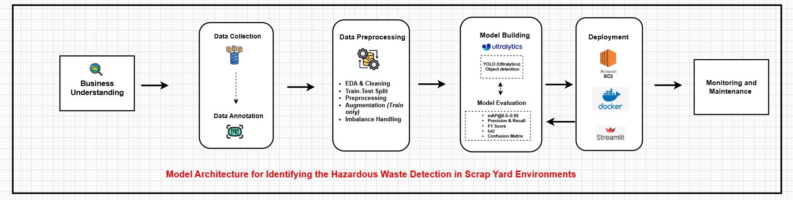

<h1 align="center">Hazardous Waste Detection in Scrap Yard Environments</h1>

----------

  

---

### 🔎 Problem Statement

Scrap yards handle **large volumes of mixed metal waste**, where hazardous items like pressurized cylinders and oil-filled shock absorbers often go unnoticed.
Missed detection can lead to **explosions, environmental damage, and worker injuries**.
Manual inspection is unreliable due to **speed, fatigue, and visibility issues**, causing **15–25% miss rates**.
This creates a need for an **automated, real-time detection system**.

---

### ⚠️ Key Risks & Challenges

---

### 🎯 Targeted Classes

| Class                 | Why Hazardous ⚠️                   | What Happens 💥                        | Action ⚙️                                                | Why This Action Matters 💡                               | Business Impact 💼                          |
| --------------------- | ---------------------------------- | -------------------------------------- | -------------------------------------------------------- | -------------------------------------------------------- | ------------------------------------------- |
| **Gas_Cylinder**      | High-pressure gas stored inside    | Explosion when crushed/heated          | Detect → Isolate → Check pressure → Depressurize → Scrap | Pressure release prevents blast during shredding         | Avoids catastrophic damage & worker injury  |
| **Shock_Absorber**    | Contains pressurized oil/gas       | Sudden rupture → flying debris         | Detect → Remove → Depressurize → Scrap                   | Removing internal pressure prevents rupture              | Reduces accidents & machine downtime        |
| **Capacitor**         | Stores electrical charge           | Sudden discharge → sparks/fire         | Detect → Discharge → Inspect → Process                   | Safe discharge eliminates electrical hazard              | Protects equipment & prevents fire risk     |
| **Motor**             | Electrical + mechanical components | Sparks, oil leakage, heavy part injury | Detect → Inspect → Test → Reuse / Resell or Scrap        | Motors may still work → recover value instead of wasting | Increases profit & reduces material loss 💰 |
| **Sealed_Tank**       | Unknown contents (gas/liquid)      | Unexpected explosion or toxic leak     | Detect → Isolate → Inspect → Controlled handling         | Unknown risk must be verified before processing          | Prevents unpredictable failures & hazards   |
| **Fire_Extinguisher** | Pressurized chemical container     | Explosion or chemical exposure         | Detect → Remove → Depressurize → Safe recycle            | Releasing pressure avoids blast risk                     | Ensures safety & regulatory compliance      |

