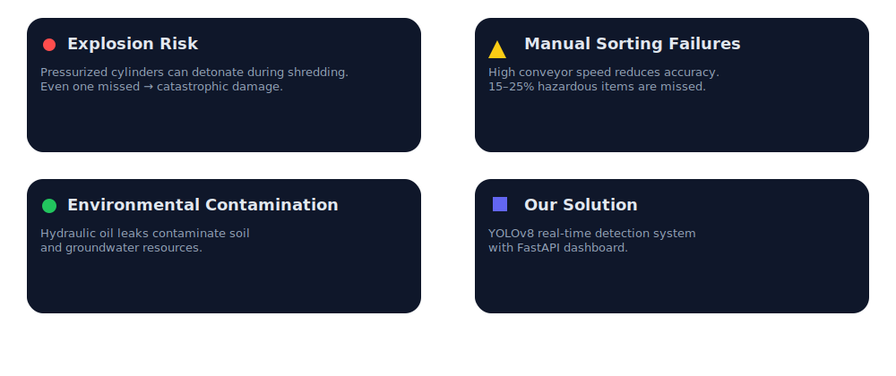

<h1 align="center">Hazardous Waste Detection in Scrap Yard Environments</h1>

----------

  

---

### 🔎 Problem Statement

Scrap yards handle **large volumes of mixed metal waste**, where hazardous items like pressurized cylinders and oil-filled shock absorbers often go unnoticed.
Missed detection can lead to **explosions, environmental damage, and worker injuries**.
Manual inspection is unreliable due to **speed, fatigue, and visibility issues**, causing **15–25% miss rates**.
This creates a need for an **automated, real-time detection system**.

---

### ⚠️ Key Risks & Challenges

---

### 🎯 Targeted Classes

| Class                 | Risk              | Key Issue           | Action                           | Business Impact                  |
| --------------------- | ----------------- | ------------------- | -------------------------------- | -------------------------------- |
| **Gas_Cylinder**      | Pressure          | Explosion           | Detect → Isolate → Depressurize  | Prevents major damage & injuries |
| **Shock_Absorber**    | Pressure          | Rupture             | Detect → Remove → Depressurize   | Reduces accidents & downtime     |
| **Capacitor**         | Energy            | Electric discharge  | Detect → Discharge → Process     | Protects equipment               |
| **Canister**          | Chemical/Pressure | Leakage / Explosion | Detect → Inspect → Handle safely | Improves hazard detection        |
| **Sealed_Tank**       | Unknown           | Hidden risk         | Detect → Inspect → Control       | Avoids unexpected failures       |
| **Fire_Extinguisher** | Pressure          | Explosion           | Detect → Remove → Depressurize   | Ensures workplace safety         |

