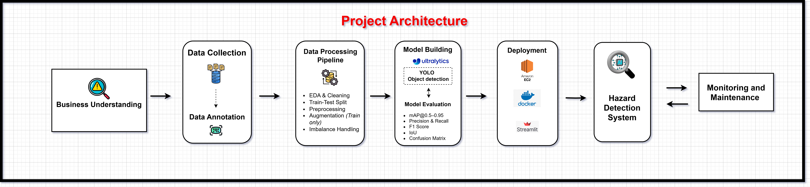

<h1 align="center">Hazardous Waste Detection in Scrap Yard Environments</h1>

----------

  

---

# 🔎 Problem Statement

Scrap yards process **1000+ tons of mixed metal waste**, where hazardous objects such as pressurized cylinders, shock absorbers, sealed tanks, capacitors, and other industrial components are difficult to identify during sorting operations.

Failure to detect these materials can lead to **explosions, fires, equipment damage, and serious worker injuries**, especially during shredding or crushing processes. These incidents not only compromise safety but also result in **operational downtime and significant financial losses**.

Current inspection methods rely on **manual monitoring**, which is slow, inconsistent, and prone to human error. Factors such as fatigue, high processing speed, and limited visibility contribute to estimated miss rates of **15–25%**, making manual inspection unreliable for real-time industrial environments.

In addition, certain components such as motors may still retain **functional or resale value**, but are often misclassified as scrap due to lack of proper identification. This leads to **inefficient resource utilization and loss of potential revenue**.

👉 These challenges have a direct **impact on overall business performance**:

* **Financial Loss** – medical costs, machine damage, higher insurance
* **Operational Downtime** – production stops, reduced efficiency
* **Legal & Compliance Risks** – penalties, compensation claims
* **Reputation & Workforce Impact** – loss of trust, low morale, reduced productivity

👉 Therefore, there is a **need to address these challenges** through an **automated, real-time hazard detection and decision-making system** that can:

* Continuously monitor scrap materials without human dependency
* Accurately detect hazardous objects in real time
* Trigger appropriate actions (alerts, isolation, safe handling)
* Reduce safety risks and prevent equipment damage
* Improve operational efficiency and minimize downtime
* Enable intelligent decision-making for reuse, recycling, or disposal
* Support value recovery by identifying reusable components like motors

---

### 🎯 Targeted Classes

| Class                 | Why Hazardous ⚠️                   | What Happens 💥                        | Action ⚙️                                                | Why This Action Matters 💡                               | Business Impact 💼                          |
| --------------------- | ---------------------------------- | -------------------------------------- | -------------------------------------------------------- | -------------------------------------------------------- | ------------------------------------------- |
| **Gas_Cylinder**      | High-pressure gas stored inside    | Explosion when crushed/heated          | Detect → Isolate → Check pressure → Depressurize → Scrap | Pressure release prevents blast during shredding         | Avoids catastrophic damage & worker injury  |
| **Shock_Absorber**    | Contains pressurized oil/gas       | Sudden rupture → flying debris         | Detect → Remove → Depressurize → Scrap                   | Removing internal pressure prevents rupture              | Reduces accidents & machine downtime        |
| **Capacitor**         | Stores electrical charge           | Sudden discharge → sparks/fire         | Detect → Discharge → Inspect → Process                   | Safe discharge eliminates electrical hazard              | Protects equipment & prevents fire risk     |
| **Motor**             | Electrical + mechanical components | Sparks, oil leakage, heavy part injury | Detect → Inspect → Test → Reuse / Resell or Scrap        | Motors may still work → recover value instead of wasting | Increases profit & reduces material loss 💰 |
| **Sealed_Tank**       | Unknown contents (gas/liquid)      | Unexpected explosion or toxic leak     | Detect → Isolate → Inspect → Controlled handling         | Unknown risk must be verified before processing          | Prevents unpredictable failures & hazards   |
| **Fire_Extinguisher** | Pressurized chemical container     | Explosion or chemical exposure         | Detect → Remove → Depressurize → Safe recycle            | Releasing pressure avoids blast risk                     | Ensures safety & regulatory compliance      |

---

  

